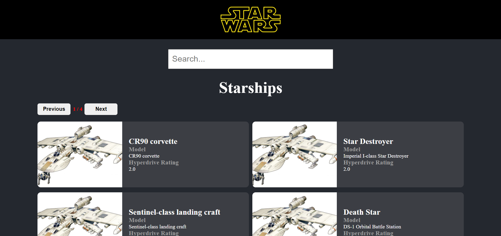
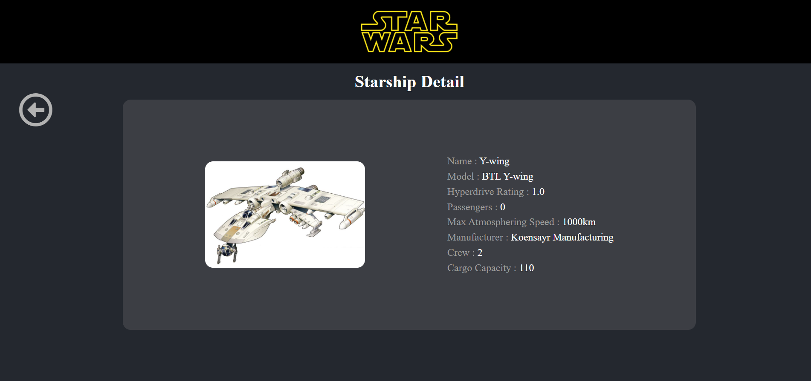

# 112 Trendyol Front-End Bootcamp | Week-4 Homework

## Content of StarWars App

- This Vue.js project lists Starwars starships with details. Starships can be searched with their names and models.



- Starships in list can be shown on a new screen with more details by clicking starship card.



## Build Setup

``` bash
# install dependencies
npm install

# serve with hot reload at localhost:8080
npm run dev

# build for production with minification
npm run build
```

For detailed explanation on how things work, consult the [docs for vue-loader](http://vuejs.github.io/vue-loader).
